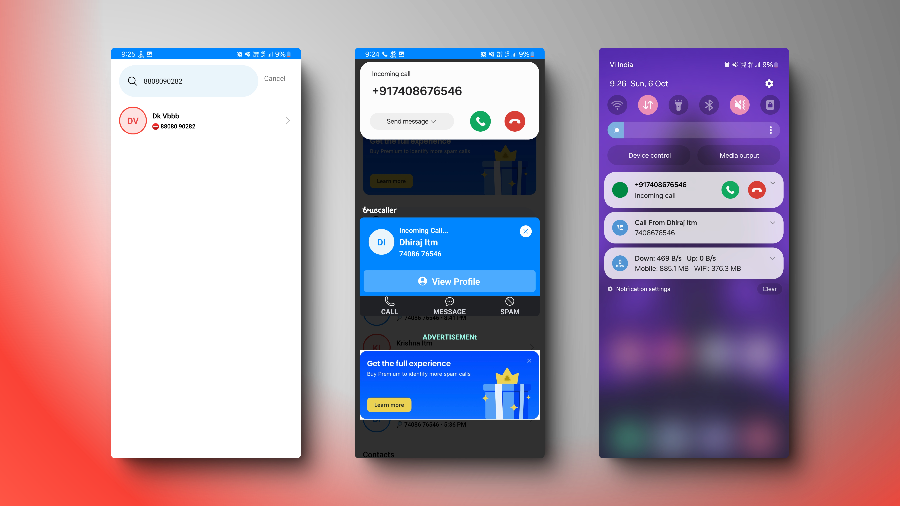
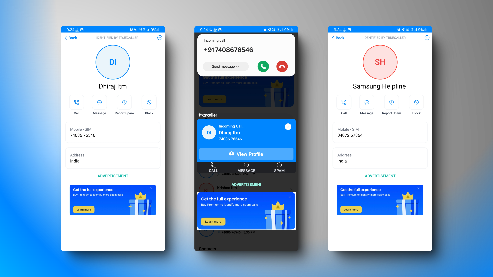

# Truecaller Clone - Full Stack React Native | Node js backend

## 👇Click Here to Watch Demo 

## Showcase Screenshots

---

A **Truecaller clone** that demonstrates advanced integration of React Native and Kotlin native modules. This app is designed to detect incoming calls, display caller ID, screen spam. It's a hands-on learning project  , featuring robust call detection and spam filtering mechanisms.

## Features

- **Call Detection**: Detect incoming and outgoing calls with real-time notifications.
- **Caller ID & Spam Detection**: Identify caller details and check for spam numbers.
- **Kill Mode**: Activate headless JS task to run background processes for enhanced performance and call handling.
- **React Native & Kotlin Bridge**: Utilize Kotlin for Android-specific functionalities and integrate with React Native.
- **Push Notifications**: Implement **Notifee** for enhanced push notifications during call events.
- **State Management**: Handle app state efficiently with **Zustand**.

## Tech Stack

- **React Native CLI**: Build the app with native Android functionalities.
- **Kotlin Native Modules**: Integrate Android-specific features via Kotlin.
- **Node.js & MongoDB**: Backend API for managing and storing user data.
- **Zustand**: Lightweight state management for React Native.
- **Call Detection & Screening**: Use SDK Call Kotlin for monitoring incoming calls.
- **Notifee**: Advanced notifications for call and spam alerts.
- **Headless JS**: Background processing for Kill Mode.

## Usage

- Upon launch, the app listens for incoming and outgoing calls.
- Displays caller information and flags spam calls based on the number’s reputation.
- Utilize the "Kill Mode" for advanced call screening and background task execution.

## Contact
Kannaujiya00000@gmail.com

## Contributing

Feel free to fork this repository and contribute by submitting a pull request.

## License

This project is licensed under the MIT License.

